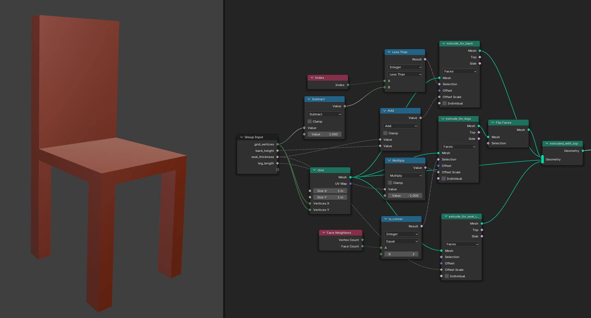
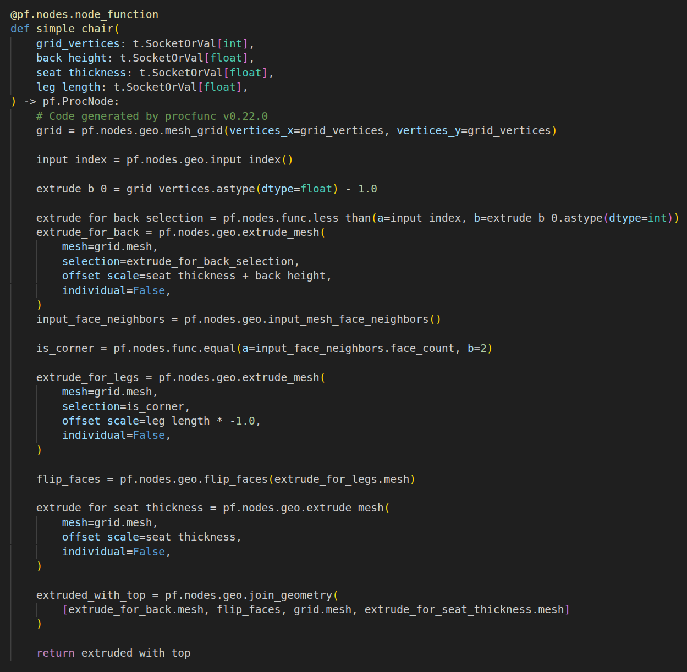

# ProcFunc: A Framework for Compositional Procedural Data Generation

[**Documentation**](#documentation)
| [**Research Paper**](#paper)
| [**Documentation**](#paper)
| [**Transpiling**](#transpile-a-blender-file-to-procfunc-code)
| [**Experiments**](#experiments)
| [**Contributing**](#contributing)

### Installation

Use [uv](https://docs.astral.sh/uv/getting-started/installation/) or your favorite package manager to install procfunc via pip:
```bash
uv pip install procfunc
```

ProcFunc depends on `bpy==4.2.0` which requires Python==3.11.x. 
Other `bpy` or Python versions are therefore not yet supported. 

### Usage:

See [procfunc.readthedocs.io](https://procfunc.readthedocs.io) for available functions
Many pre-made procfunc generators are coming soon in [infinigen](https://github.com/princeton-vl/infinigen).

Since we have not yet reached [semver 1.0.0](https://semver.org/) we have not yet finalized procfunc's interface. 
In the meantime, each 0.X.0 may introduce interface changes. Please pin `uv add procfunc<0.XX` where X is the current version.

Please create Github Issues for any unclear interfaces or bugs!

##### Transpile a blender file to ProcFunc code

<p float="left">
  
  
</p>

Convert a Blender geometry node tree into procfunc Python code by downloading our example blend and executing the transpiler:
```bash
wget https://raw.githubusercontent.com/princeton-vl/procfunc/main/examples/transpile_simple_chair/simple_chair.blend
uv run python -m procfunc.transpiler.main simple_chair.blend --node_trees simple_chair --output transpiled_code.py
```

See the expected output in [`examples/transpile_simple_chair/transpiled_code.py`](examples/transpile_simple_chair/transpiled_code.py).
To use the code, you can add `pf.ops.file.save_blend("test.blend")` to the end of it, then open the generated blender file.
You can also open and edit the blender geonodes prior to transpiling in order to generate different procfunc code.

##### Intended styleguide for ProcFunc code

Prefer `pf.ops` to any `bpy.ops`

Do not use `bpy.data.objects[name]` or similar - refer to assets by variables, not names or global scope.

If an object or material goes out of scope, it is assumed to be inaccessible and deleted implicitly (like a normal python variable)

### Paper

If you find procfunc useful, please cite our paper:
```
TODO TODO BIBTEX
```

### Experiments

See [experiments/EXPERIMENTS.md](experiments/EXPERIMENTS.md)

NOTE: experiments are only intended to be correct when using the `experiments` branch, which will not see major updates.

### Contributing

Please create an issue for any proposed features to discuss them before implementing.

##### Developer Installation
```bash
git clone git@github.com:princeton-vl/procfunc.git
cd procfunc
uv venv
uv pip install -e .[dev]
uv run pre-commit install
```

##### Tools

```bash
uv run ruff format
uv run ruff check --fix
uv run pytest -n 4
```

##### Todos / Sharp Edges

Add optional support for bpy==4.x and 5.x and maybe 3.6, all under the same procfunc interface. 

pf.ops is missing some blender functions and arguments, especially returning "selection" masks for some cases. 

pf.ops is mostly imperative, not functional, since it mutates its arguments. for v1.0.0 

pf.tracer does not currently guarantee identical results for regular vs traced execution.

Assets like pf.MeshObject and pf.Material are not currently cleaned up upon going out of scope 
